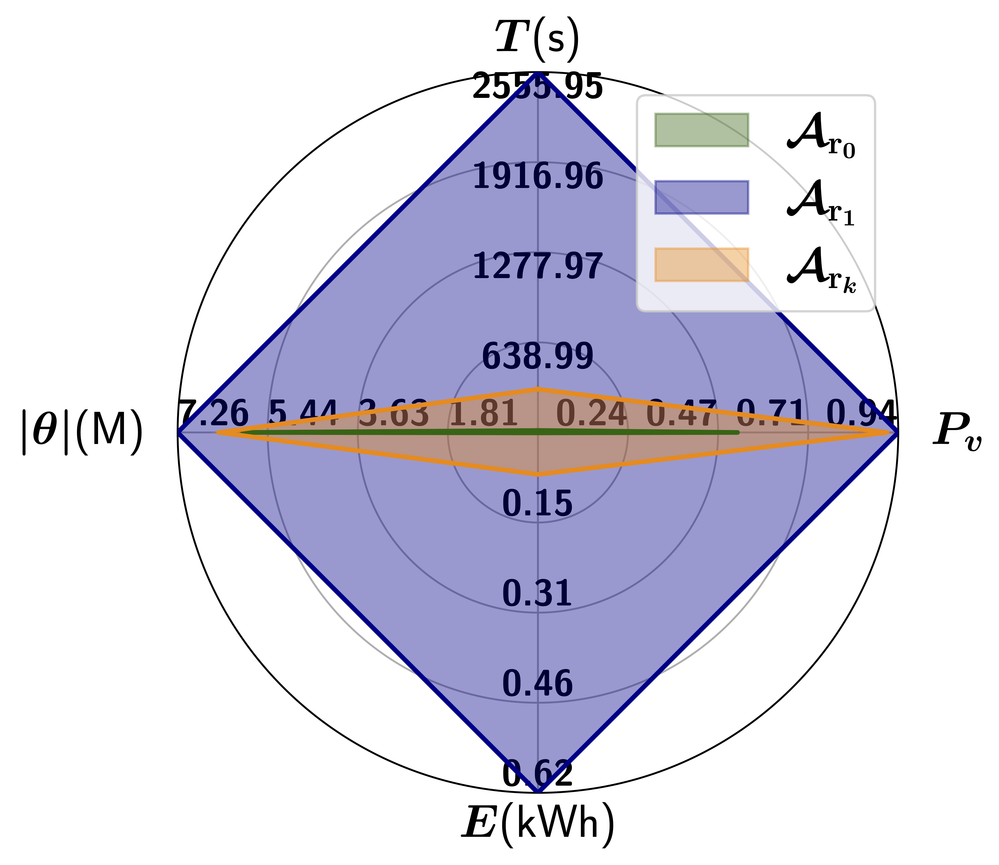
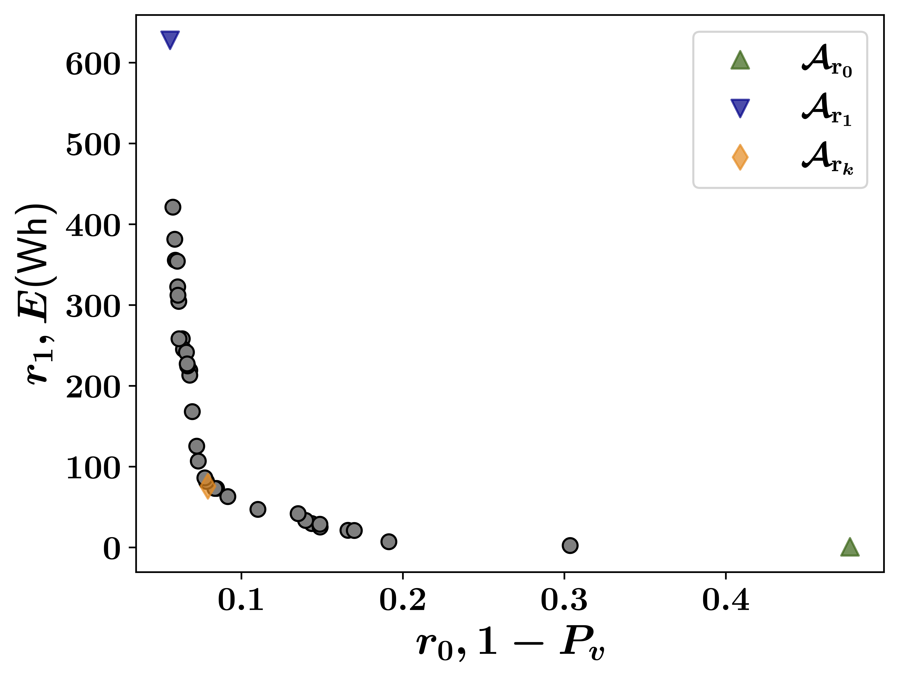
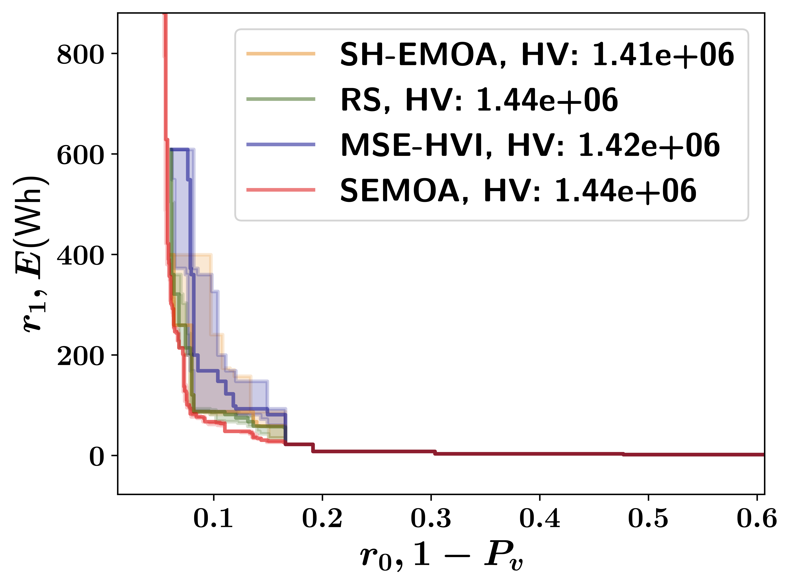

# [ICASSP 2024] EC-NAS-Bench


## Abstract
Energy consumption from the selection, training, and deployment of deep learning models has seen a significant uptick recently. 
This work aims to facilitate the design of energy-efficient deep learning models that require less computational resources and prioritize environmental sustainability. 
Neural architecture search (NAS) benefits from tabular benchmarks, which evaluate NAS strategies cost-effectively through pre-computed performance statistics. 
We advocate for including energy efficiency as a pivotal performance criterion in NAS. To this end, we introduce an enhanced tabular benchmark encompassing data on energy consumption for varied architectures. 
The benchmark, designated as EC-NAS, has been made available in an open-source format to advance research in energy-conscious NAS.
EC-NAS-Bench incorporates a surrogate model to predict energy consumption, aiding in diminishing the energy expenditure of dataset creation. 
Our findings emphasize the potential of EC-NAS by leveraging multi-objective optimization algorithms, revealing a balance between energy use and accuracy. 
This suggests the feasibility of identifying energy-lean architectures without compromising performance.

<p float="left">
  
  
</p>
<p float="left">
  
  
</p>

## Citation
Kindly use the following BibTeX entry if you use the code in your work.
```
@article{bakhtiarifard2023ecnasbench,
 	title={Energy Consumption-Aware Tabular Benchmarks for Neural Architecture Search},
	author={Pedram Bakhtiarifard and Christian Igel and Raghavendra Selvan},
 	journal={arXiv preprint arXiv:2023.2210.06015},
	year={2023}}
```

## Benchmark Overview

#### Surrogate Benchmarks
| Benchmark File                    | Description          | Dataset  | Space | Hardware             | Architectures | Datapoints | Surrogate Type |
|-----------------------------------|----------------------|----------|-------|----------------------|---------------|------------|----------------|
| `energy_7V9E_surrogate.tfrecord`  | Image Classification | CIFAR-10 | 7V    | NVIDIA Quadro RTX 6000 | 423K         | 1.6M       | MLP            |
| `energy_5V9E_linscale.tfrecord`   | Image Classification | CIFAR-10 | 5V    | NVIDIA Quadro RTX 6000 | 2632         | 10528      | Linear Scaling |
| `energy_4V9E_linscale.tfrecord`   | Image Classification | CIFAR-10 | 4V    | NVIDIA Quadro RTX 6000 | 91           | 364        | Linear Scaling |

#### Non-Surrogate Benchmarks (4 Epochs)
| Benchmark File                    | Description          | Dataset  | Space | Hardware             | Architectures | Datapoints | Surrogate Type |
|-----------------------------------|----------------------|----------|-------|----------------------|---------------|------------|----------------|
| `energy_7V9E_4epochs.tfrecord`    | Image Classification | CIFAR-10 | 7V    | NVIDIA Quadro RTX 6000 | 4877         | 19508      | --             |
| `energy_5V9E_4epochs.tfrecord`    | Image Classification | CIFAR-10 | 5V    | NVIDIA Quadro RTX 6000 | 2632         | 2632       | --             |
| `energy_4V9E_4epochs.tfrecord`    | Image Classification | CIFAR-10 | 4V    | NVIDIA Quadro RTX 6000 | 91           | 91         | --             |

#### Hardware-Specific Benchmarks
| Benchmark File                    | Description          | Dataset  | Space | Hardware             | Architectures | Datapoints | Surrogate Type |
|-----------------------------------|----------------------|----------|-------|----------------------|---------------|------------|----------------|
| `energy_4V9E_quadrortx6000.tfrecord` | Image Classification | CIFAR-10 | 4V    | NVIDIA Quadro RTX 6000 | 91           | 91         | --             |
| `energy_4V9E_rtx3060.tfrecord`    | Image Classification | CIFAR-10 | 4V    | NVIDIA RTX 3060      | 91           | 88         | --             |
| `energy_4V9E_rtx3090.tfrecord`    | Image Classification | CIFAR-10 | 4V    | NVIDIA RTX 3090      | 91           | 91         | --             |
| `energy_4V9E_titanxp.tfrecord`    | Image Classification | CIFAR-10 | 4V    | NVIDIA Titan Xp      | 91           | 91         | --             |

## Requirements
To install the requirements, using Conda, run the following command:
```sh 
$ conda env create --name envname --file=environment.yml
```
Due to possible dependency issues for newer hardware, pip requirements are also included separately.
To install the requirements, using pip, use the following command:
```sh 
$ pip install -r requirements.txt
```

## Example Usage
Experiments can be found in the `ecnas/examples` directory and run with e.g., `python -m ecnas.examples.semoa`.
```python
from baselines import save_experiment
from baselines.methods.semoa import SEMOA

from baselines.problems.ecnas import ecnasSearchSpace
from baselines.problems import get_ecnas
from tqdm import tqdm
import numpy as np

num_nodes = 7
ops_choices = ["conv3x3-bn-relu", "conv1x1-bn-relu", "maxpool3x3"]

# Parameters ecnas
N_init = 10
min_budget = 4
max_budget = 108
max_function_evals = 100

trials = 10

for run in tqdm(range(trials)):
    np.random.seed(run)
    search_space = ecnasSearchSpace(num_nodes, ops_choices)
    experiment = get_ecnas(num_nodes, ops_choices, "SEMOA")

    ea = SEMOA(
        search_space,
        experiment,
        population_size=10,
        num_generations=max_function_evals,
        min_budget=min_budget,
        max_budget=max_budget,
    )
    ea.optimize()

    res = experiment.fetch_data().df
    save_experiment(res, f"experiments/semoa/{num_nodes}v_{experiment.name}_{run}.pickle")
    print(res)
```
